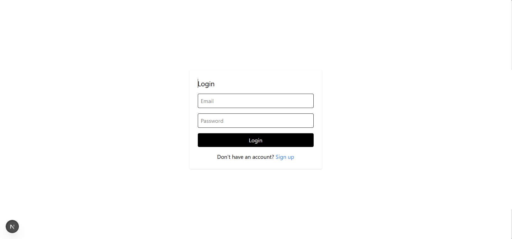
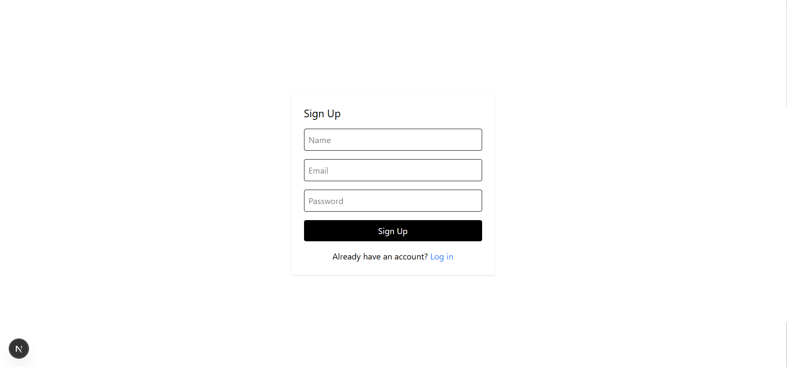
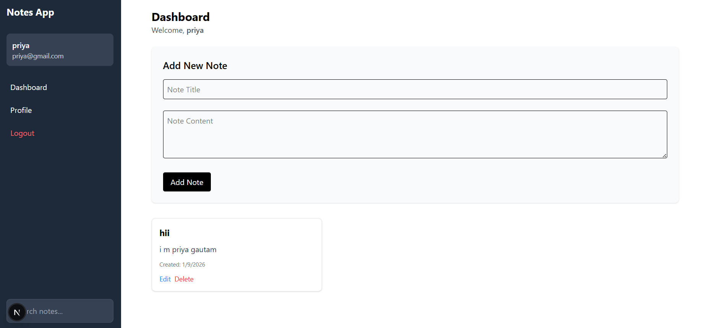

# Scalable Web Application

A full-stack scalable web application built with Next.js (frontend) and Node.js/Express (backend) featuring user authentication, note management, and responsive design.

## Screenshot





## Features

- **Authentication System**: Secure user signup, login, and profile management
- **Note Management**: Create, read, update, and delete personal notes
- **Search Functionality**: Real-time search through notes
- **Responsive Design**: Works seamlessly on desktop and mobile devices
- **Modern UI**: Clean and intuitive user interface
- **Secure API**: JWT-based authentication for secure data access

## Tech Stack

### Frontend

- **Next.js 16.1.1**: React framework for production
- **React 19.2.3**: JavaScript library for building user interfaces
- **TypeScript**: Strong typing for improved code quality
- **Tailwind CSS**: Utility-first CSS framework

### Backend

- **Node.js**: JavaScript runtime environment
- **Express**: Web application framework
- **MongoDB**: NoSQL database
- **Mongoose**: MongoDB object modeling
- **JSON Web Tokens (JWT)**: Secure authentication
- **bcryptjs**: Password hashing

## Project Structure

```
Scalable_Web_App/
├── backend/
│   ├── src/
│   │   ├── controllers/     # Request handlers
│   │   ├── middleware/      # Authentication middleware
│   │   ├── models/          # Database models
│   │   ├── routes/          # API route definitions
│   │   └── server.js        # Main server file
│   └── package.json
├── frontend/
│   ├── app/                 # Next.js app directory
│   ├── components/          # Reusable React components
│   ├── services/            # API service functions
│   ├── utils/               # Utility functions
│   └── package.json
├── API_Documentation.md     # API documentation
├── Scaling_Notes.md         # Scalability strategies
└── README.md                # This file
```

## Installation

### Prerequisites

- Node.js (v16 or higher)
- MongoDB (local installation or cloud MongoDB Atlas)

### Backend Setup

1. Navigate to the backend directory:

```bash
cd backend
```

2. Install dependencies:

```bash
npm install
```

3. Create a `.env` file in the `backend` directory with the following content:

```env
PORT=5000
MONGO_URI=mongodb://localhost:27017/scalable_web_app
JWT_SECRET=your-super-secret-jwt-key-change-in-production
NODE_ENV=development
```

4. Start the backend server:

```bash
npm run dev
```

### Frontend Setup

1. Navigate to the frontend directory:

```bash
cd frontend
```

2. Install dependencies:

```bash
npm install
```

3. Start the development server:

```bash
npm run dev
```

## Usage

1. Open your browser and navigate to `http://localhost:3000`
2. Sign up for a new account or log in if you already have one
3. Start creating and managing your notes
4. Use the search functionality to find specific notes

## API Endpoints

### Authentication

- `POST /api/auth/signup` - Register a new user
- `POST /api/auth/login` - Authenticate a user
- `GET /api/auth/profile` - Get authenticated user's profile
- `PUT /api/auth/profile` - Update authenticated user's profile

### Notes

- `GET /api/notes` - Get all notes for authenticated user (supports search)
- `POST /api/notes` - Create a new note
- `GET /api/notes/:id` - Get a specific note
- `PUT /api/notes/:id` - Update a specific note
- `DELETE /api/notes/:id` - Delete a specific note

## Environment Variables

### Backend (.env file)

- `PORT`: Port number for the server (default: 5000)
- `MONGO_URI`: MongoDB connection string
- `JWT_SECRET`: Secret key for JWT signing
- `NODE_ENV`: Environment mode (development/production)

## Development

### Running in Development Mode

- Backend: `npm run dev` in the backend directory
- Frontend: `npm run dev` in the frontend directory

### Running in Production Mode

- Build the frontend: `npm run build` in the frontend directory
- Start the backend: `npm start` in the backend directory

## Scalability Features

This application includes several features designed for scalability:

- Stateless authentication using JWT tokens
- Efficient database queries with Mongoose
- Responsive UI that works across devices
- Modular code structure for easy maintenance
- Proper error handling and validation

For detailed scalability strategies, see the [Scaling_Notes.md](./Scaling_Notes.md) file.

## Contributing

1. Fork the repository
2. Create a feature branch (`git checkout -b feature/amazing-feature`)
3. Commit your changes (`git commit -m 'Add some amazing feature'`)
4. Push to the branch (`git push origin feature/amazing-feature`)
5. Open a Pull Request

## License

This project is licensed under the MIT License - see the LICENSE file for details.

## Support

If you encounter any issues, please open an issue in the repository or contact the development team.

---

Built with ❤️ by the Scalable Web App Team
